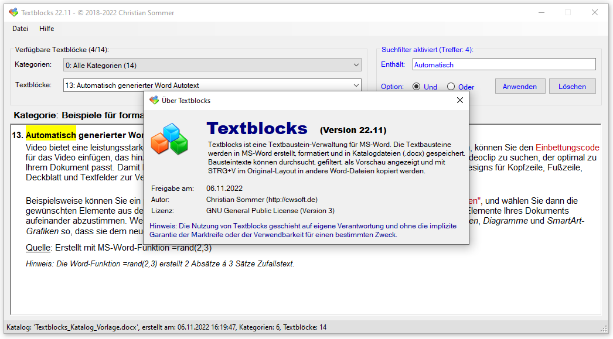

# Textblocks (WinForms, C# 10)
Textblocks ist eine **Textbausteinverwaltung für MS-Word**. Textbausteine werden in MS-Word erstellt, formatiert, kategorisiert und in Katalogdateien (.docx) verwaltet. Die erstellten Katalogdateien (.docx) können von Textblocks geladen, angezeigt und durchsucht werden. Der in der Vorschau angezeigte Textbaustein steht im Originallayout in der Zwischenablage zur Verfügung und kann über **(STRG+V)** in andere Word-Dokumente eingefügt werden.

Textblocks spielt seine Stärke vor allem da aus, wo große Word-Dokumente nach Textbausteinen durchsucht werden, um diese anschließend manuell ins Zieldokument zu kopieren. Weitere Informationen enthält die [Bedienungsanleitung](./Dokumentation/Textblocks.pdf).

## Mindestanforderungen
- Windows Betriebssystem (ab Windows 10)
- Microsoft Word (getestet mit MS-Word 2010-2019, **Hinweis:** Office-365 wird nicht unterstützt)
- Katalogdatei (.docx) mit Textbausteinen
- **Für Selbst-Kompilierer:**
  - [Office PIA](./Textblocks/PIA/Howto-Office-PIA.md) `Microsoft.Office.Interop.Word.dll`
  - MS Visual Studio (oder kompatiblen C#-Compiler) 
  - Textblocks ist für NET Framework 4.8 bis Net 6 kompilierbar
  - Ziel-Framework in `Textblocks.csproj`: `<TargetFramework>net48|net6.0-windows</TargetFramework>` 
  - Es werden kompatible Sprachfeatures von C# 10 genutzt

## Aufbau der Katalogdateien
Informationen zum Aufbau der Katalogdateien .docx sind im Beispielkatalog [Textblocks_Katalog_Vorlage.dotx](https://github.com/cwsoft/Textblocks/blob/main/Kataloge/Textblocks_Katalog_Vorlage.docx?raw=true) enthalten. Jede Katalogdatei muss mindestens zwei Word-Formatvorlagen enthalten, damit die Anwendung `Textblocks.exe` die jeweiligen Start- und Endpositionen der enthaltenen **Kategorien** und **Textblöcke** ermitteln kann.

Sofern über die erweiterten Eigenschaften der jeweiligen Word-Katalogdatei: `MS-Word: Datei -> Informationen -> Eigenschaften -> Erweiterte Eigenschaften -> Anpassen` keine eigenen Formatvorlagen-Namen definiert wurden, wird standardmäßig nach folgenden beiden Formatvorlagen-Namen gesucht:
- **categoryStyleName**: `tb_Kategorie`
- **textblockStyleName**: `tb_Textblock`

## Lizenz
Textblocks wurde vom Autor im Oktober 2018 als rein privates Projekt gestartet und im Mai 2022 unter der [GNU General Public License](./LICENSE.txt) (Version 3) auf GitHub für Interessierte zur Verfügung gestellt. 

Viel Spaß
cwsoft
